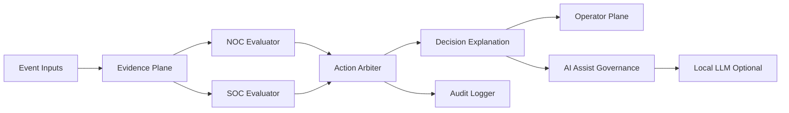

# AZ-01 Azazel-Edge - Deterministic Edge SOC/NOC Gateway

> **Codename:** `SENTINEL`


[](https://github.com/01rabbit/Azazel-Edge/actions/workflows/ci.yml)
[](https://github.com/01rabbit/Azazel-Edge/releases)
[](LICENSE)
[](docs/INDEX.md)


[](https://www.blackhat.com/)

Azazel-Edge is the AZ-01 core platform of the Azazel system, a Raspberry Pi-oriented deterministic edge SOC/NOC gateway and Cyber Scapegoat Gateway for constrained, temporary, and high-risk networks.

It observes local network evidence, evaluates NOC/SOC state deterministically, selects bounded actions (`observe`, `notify`, `throttle`, `redirect`, `isolate`), and records operator-visible explanations and audit traces.

Optional local AI assist may summarize or explain events, but it does not replace the deterministic decision loop.

Azazel-Edge is not a production SIEM replacement, not an autonomous AI defender, and not a promise of complete attack prevention.

**Who this is for:** security operators, field defenders, incident responders, training teams, and researchers working with constrained local networks.

## Requirements

| Requirement | Detail |
|---|---|
| Hardware | Raspberry Pi-oriented; tested/developed for constrained edge deployment |
| OS | Raspberry Pi OS / Linux |
| Runtime | Python 3.10+, Rust core components |
| Network | Local edge segment with optional Suricata/OpenCanary integration |
| Optional | Ollama, Mattermost, Wazuh, Vector, Aggregator |

## Quick Start

```bash
cd /home/azazel/Azazel-Edge
sudo ENABLE_INTERNAL_NETWORK=1 \
     ENABLE_APP_STACK=1 \
     ENABLE_AI_RUNTIME=1 \
     ENABLE_DEV_REMOTE_ACCESS=0 \
     bash installer/internal/install_all.sh
```

Minimal verification:

```bash
sudo systemctl status azazel-edge-web azazel-edge-control-daemon azazel-edge-core --no-pager
```

Detailed install/deploy guidance:
- [Deployment Profiles](docs/DEPLOYMENT_PROFILES.md)
- [Operator Guide](docs/OPERATOR_GUIDE.md)
- [Field Deployment Guide](docs/FIELD_DEPLOYMENT_GUIDE.md)

## Architecture Overview



Full architecture:
- [Decision Loop](docs/architecture/decision-loop.md)
- [Deception Routing](docs/architecture/deception-routing.md)
- [Local AI Triage](docs/architecture/local-ai-triage.md)
- [Evidence Model](docs/architecture/evidence-model.md)

## What Azazel-Edge does

- runs a local edge gateway and operations surface
- ingests local telemetry such as Suricata EVE
- evaluates NOC and SOC state through deterministic evaluators
- selects bounded actions through an Action Arbiter
- records explanations, alternatives, and audit traces
- supports replay-safe demos and operator workflows
- optionally uses local AI assist for summaries and triage hints

## Security Boundary Summary

Azazel-Edge claims:
- local-first deterministic decision support
- explicit bounded actions
- operator-visible explanation and audit traces
- optional AI assist that remains secondary to deterministic control

Azazel-Edge does not claim:
- complete attack prevention
- full SIEM replacement
- autonomous AI defense
- legal or regulatory compliance by itself
- safe deployment without operator understanding

## Concept Profiles

Azazel-Edge is maintained as a single core platform.
Different operational profiles are documented as concept profiles, not forks.

- [Evolution Map](docs/concepts/evolution-map.md)
- [Offline Edge-AI SOC/NOC](docs/concepts/offline-edge-ai-socnoc.md)
- [Deterministic Edge Decision Support](docs/concepts/deterministic-edge-decision-support.md)
- [Auditable Edge SOC/NOC](docs/concepts/auditable-edge-socnoc.md)
- [Field-Deployable Scapegoat Gateway](docs/concepts/field-deployable-scapegoat-gateway.md)

## Arsenal Demonstrations

Only accepted and public Black Hat Arsenal appearances are recorded here.

- [Black Hat Asia 2026](docs/arsenal/blackhat-asia-2026.md)
- [Black Hat USA 2026](docs/arsenal/blackhat-usa-2026.md)

See [Arsenal Demonstration History](docs/arsenal/README.md).

## Documentation Map

Primary entry points:
- [Documentation Index](docs/INDEX.md)
- [Core Runtime Architecture (P0)](docs/P0_RUNTIME_ARCHITECTURE.md)
- [API Reference](docs/API_REFERENCE.md)
- [Configuration Reference](docs/CONFIGURATION.md)
- [Deployment Profiles](docs/DEPLOYMENT_PROFILES.md)
- [Arsenal Demo Profile](docs/ARSENAL_DEMO_PROFILE.md)
- [Operator Guide](docs/OPERATOR_GUIDE.md)
- [AI Operation Guide](docs/AI_OPERATION_GUIDE.md)
- [Privacy and Legal Notes](docs/PRIVACY_AND_LEGAL.md)
- [Changelog](docs/CHANGELOG.md)

## Repository Layout

| Path | Role |
|---|---|
| `py/azazel_edge/` | Evidence Plane, evaluators, arbiter, explanations, audit |
| `py/azazel_edge_control/` | Control daemon and action handlers |
| `py/azazel_edge_ai/` | AI agent integration and M.I.O. assist path |
| `azazel_edge_web/` | Flask backend, dashboard, ops-comm UI |
| `rust/azazel-edge-core/` | Rust defense core |
| `runbooks/` | Runbook registry |
| `configs/profiles/` | Concept-to-configuration mapping layer |
| `demos/concepts/` | Concept-oriented deterministic demo grouping |
| `docs/` | Architecture, concept, operations, and reference documentation |

## License

MIT. See [LICENSE](LICENSE).
