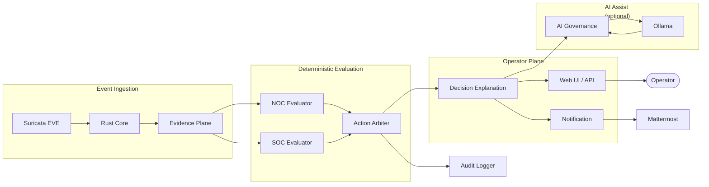

# Azazel-Edge

[](https://github.com/01rabbit/Azazel-Edge/actions/workflows/ci.yml)
[](LICENSE)


Azazel-Edge is a Raspberry Pi-oriented edge operations stack that combines:
- internal network/gateway setup
- deterministic NOC/SOC evaluation and action selection
- Web UI + API + runbook workflow for operators
- optional local AI assist (Ollama + Mattermost integration)

This README is based on verified repository contents (code, scripts, tests, git history, GitHub issue/PR metadata) as of **2026-05-11**.

## What is Azazel-Edge?

Azazel-Edge is a **lightweight SOC/NOC gateway for emergency operations**, designed to run on a Raspberry Pi.

**Who it's for**
- Security staff running a temporary network segment (event venue, field office, training exercise)
- Operators who need first-response triage without a full SIEM
- Teams practicing incident response with a local, offline-capable stack

**When to use it**
- You need a working gateway + alert triage surface in under an hour
- You have no cloud connectivity or want to keep traffic fully local
- You want a deterministic decision engine with optional local AI assist (Ollama), not a black-box

**What it is not**
- A replacement for a production SIEM or full-time SOC platform
- An autonomous AI that makes decisions without operator confirmation
- Cloud-dependent: all core functions work offline

## Verified Purpose

The implemented purpose in this repository is:

1. Run an internal edge segment (`br0`, DHCP, NAT/forwarding) and expose an operations surface.
2. Consume normalized telemetry and evaluate NOC/SOC state deterministically.
3. Produce explicit actions (`observe`, `notify`, `throttle`, `redirect`, `isolate`) with explanation/audit payloads.
4. Provide operator workflows (dashboard, triage, runbooks, Mattermost bridge, deterministic demo).
5. Optionally assist with local LLM inference through Ollama (bounded assist path, not mandatory for deterministic demo path).

Evidence:
- Gateway/network baseline: `installer/internal/install_internal_network.sh`
- Deterministic action model: `py/azazel_edge/arbiter/action.py`
- Web/API surfaces: `azazel_edge_web/app.py`
- Demo deterministic replay: `bin/azazel-edge-demo`, `py/azazel_edge/demo/scenarios.py`
- AI agent runtime: `py/azazel_edge_ai/agent.py`, `systemd/azazel-edge-ai-agent.service`

## Core Architecture



1. **Event ingestion + normalization**
   - Rust core tails Suricata EVE (`AZAZEL_EVE_PATH`, default `/var/log/suricata/eve.json`) and emits normalized alert events.
   - Rust core forwards to Unix socket (`/run/azazel-edge/ai-bridge.sock`) and/or JSONL log.
2. **Deterministic evaluation**
   - NOC evaluator and SOC evaluator are implemented under `py/azazel_edge/evaluators/`.
   - Action arbiter decides explicit actions with rejected alternatives and decision trace.
3. **Operator plane**
   - Flask app serves dashboard (`/`), demo (`/demo`), ops workspace (`/ops-comm`), and `/api/*`.
   - Control daemon exposes Unix socket control plane at `/run/azazel-edge/control.sock`.
4. **Optional AI assist plane**
   - AI agent consumes normalized events/manual queries and writes advisory/metrics/audit JSONL.
   - Ollama and Mattermost are provisioned by optional compose-based runtime scripts.

## Entrypoints And Interfaces

### Service entrypoints
- Web app: `azazel_edge_web/app.py` (gunicorn via `systemd/azazel-edge-web.service`)
- Control daemon: `py/azazel_edge_control/daemon.py` (`systemd/azazel-edge-control-daemon.service`)
- AI agent: `py/azazel_edge_ai/agent.py` (`systemd/azazel-edge-ai-agent.service`)
- Rust core: `rust/azazel-edge-core/src/main.rs` (`systemd/azazel-edge-core.service`)
- EPD refresh timer: `systemd/azazel-edge-epd-refresh.timer`

### Web routes
- UI: `/`, `/demo`, `/ops-comm`
- Health: `/health` (no token)
- CA metadata/download: `/api/certs/azazel-webui-local-ca/meta`, `/api/certs/azazel-webui-local-ca.crt`

### Primary API groups

| Group | Endpoints | Auth required |
|-------|-----------|---------------|
| State | `GET /api/state`, `GET /api/state/stream` | Yes |
| Control | `POST /api/mode`, `POST /api/action`, `/api/wifi/*`, `/api/portal-viewer*` | Yes |
| SoT | `POST /api/clients/trust`, `PUT/PATCH /api/sot/devices` | Yes |
| Dashboard | `GET /api/dashboard/*` | Yes |
| Triage | `/api/triage/*` | Yes |
| Runbooks | `GET /api/runbooks`, `POST /api/runbooks/propose`, `POST /api/runbooks/act` | Yes |
| Demo | `/api/demo/*` | Yes |
| AI | `POST /api/ai/ask`, `GET /api/ai/capabilities` | Yes |
| Mattermost | `POST /api/mattermost/command`, `POST /api/mattermost/message` | Token |
| Health | `GET /health` | No |
| CA cert | `GET /api/certs/*` | No |

### Socket interfaces
- Control socket: `/run/azazel-edge/control.sock`
- AI bridge socket: `/run/azazel-edge/ai-bridge.sock`

### Authentication behavior
- Most `/api/*` endpoints are token-protected.
- Installer-managed runtime sets fail-closed by default (`AZAZEL_AUTH_FAIL_OPEN=0`).
- Legacy fail-open compatibility is controlled by `AZAZEL_AUTH_FAIL_OPEN` when token file is absent.
- Managed default token file is `/etc/azazel-edge/web_token.txt` via `AZAZEL_WEB_TOKEN_FILE`.

## Changelog

See [`docs/CHANGELOG.md`](docs/CHANGELOG.md) for the full implementation history and PR traceability.

## Requirements

### Runtime packages (installed by scripts)
- Core/app stack: `python3`, `python3-venv`, `network-manager`, `iw`, `dnsmasq`, `nginx`, `openssl`, `rustc`, `cargo`, and related Python system packages
- Security stack option: `docker.io`, `suricata`
- AI runtime option: `docker.io`, `qemu-user-static`, `binfmt-support`, `jq`

### Python runtime dependencies
From `requirements/runtime.txt`:
- `Flask`
- `gunicorn`
- `rich`
- `textual`
- `Pillow`
- `requests`
- `PyYAML`

### Optional external services
- Ollama container (`security/docker-compose.ollama.yml`)
- Mattermost + PostgreSQL (`security/docker-compose.mattermost.yml`)
- OpenCanary (`security/docker-compose.yml`)

## Install and Reproduce

### Unified installer

```bash
cd /home/azazel/Azazel-Edge
sudo ENABLE_INTERNAL_NETWORK=1 \
     ENABLE_APP_STACK=1 \
     ENABLE_AI_RUNTIME=1 \
     ENABLE_DEV_REMOTE_ACCESS=0 \
     bash installer/internal/install_all.sh
```

For all installer toggles and runtime variables, see [Configuration](#configuration).

### App stack only

```bash
sudo ENABLE_SERVICES=1 bash installer/internal/install_migrated_tools.sh
```

### AI runtime only

```bash
sudo ENABLE_OLLAMA=1 ENABLE_MATTERMOST=1 bash installer/internal/install_ai_runtime.sh
```

Install result (default scripts):
- Runtime files under `/opt/azazel-edge`
- Launchers under `/usr/local/bin`
- Systemd units installed and optionally enabled

## Configuration

### Installer toggles
- `ENABLE_INTERNAL_NETWORK=1|0`
- `ENABLE_APP_STACK=1|0`
- `ENABLE_AI_RUNTIME=1|0`
- `ENABLE_DEV_REMOTE_ACCESS=1|0`
- `ENABLE_RUST_CORE=1|0`

### Main runtime config files
- `/etc/default/azazel-edge-web` (Web/Mattermost-related env)
- `/etc/default/azazel-edge-security` (security stack options such as `SURICATA_IFACE`)
- `/etc/azazel-edge/first_minute.yaml` (control flags such as `suppress_auto_wifi`)

### Important environment variables (selected)
- Web bind: `AZAZEL_WEB_HOST`, `AZAZEL_WEB_PORT`
- Rust core: `AZAZEL_EVE_PATH`, `AZAZEL_AI_SOCKET`, `AZAZEL_NORMALIZED_EVENT_LOG`, `AZAZEL_DEFENSE_ENFORCE`
- AI agent: `AZAZEL_OLLAMA_ENDPOINT`, `AZAZEL_LLM_MODEL_PRIMARY`, `AZAZEL_LLM_MODEL_DEGRADED`
- Mattermost command trigger/token: `AZAZEL_MATTERMOST_COMMAND_TRIGGER`, `AZAZEL_MATTERMOST_COMMAND_TOKEN_FILE`
- Runbook controlled execution gate: `AZAZEL_RUNBOOK_ENABLE_CONTROLLED_EXEC`

### Token auth
- API token can be supplied by header `X-AZAZEL-TOKEN` (or `X-Auth-Token`) or `?token=`.
- If no token file exists, protected endpoints become effectively open.

## Usage

### Service status
```bash
sudo systemctl status \
  azazel-edge-control-daemon \
  azazel-edge-web \
  azazel-edge-ai-agent \
  azazel-edge-core
```

### Access endpoints (default installer assumptions)
- Web backend (gunicorn): `http://127.0.0.1:8084/`
- If internal network + HTTPS proxy are installed: `https://172.16.0.254/`
- Mattermost (if enabled): `http://172.16.0.254:8065/`

### API call example
```bash
TOKEN="$(cat ~/.azazel-edge/web_token.txt)"
curl -sS -H "X-AZAZEL-TOKEN: ${TOKEN}" http://127.0.0.1:8084/api/state | jq .
```

### SoT devices API contract
- `PUT /api/sot/devices`
  - Replaces the full `devices` array in SoT.
  - Request body: `{"devices": [<SoT device objects>]}`.
- `PATCH /api/sot/devices`
  - Merge/upsert semantics by `id` only (no delete behavior).
  - Existing device fields are preserved unless overwritten by payload fields.
  - Request body: `{"devices": [<partial or full SoT device objects with id>]}`.
- Both endpoints:
  - Require token auth (`@require_token()`).
  - Validate resulting full SoT via `SoTConfig.from_dict`.
  - Append audit records to `AZAZEL_SOT_AUDIT_LOG` including `actor` (`X-AZAZEL-ACTOR` preferred, then caller address).
  - Trigger re-evaluation through `refresh` after successful updates.

### Deterministic demo replay

```bash
bin/azazel-edge-demo list
bin/azazel-edge-demo run mixed_correlation_demo
```

### Runbook broker CLI
```bash
python3 py/azazel_edge_runbook_broker.py list
python3 py/azazel_edge_runbook_broker.py show rb.noc.service.status.check
python3 py/azazel_edge_runbook_broker.py propose --question "Wi-Fi intermittent disconnects"
```

## Development

### Local setup
```bash
python3 -m venv .venv
. .venv/bin/activate
pip install -U pip wheel setuptools
pip install -r requirements/runtime.txt
```

### Local run (without systemd)
```bash
PYTHONPATH=. python3 azazel_edge_web/app.py
PYTHONPATH=. python3 py/azazel_edge_control/daemon.py
PYTHONPATH=. python3 py/azazel_edge_ai/agent.py
```

Notes:
- Several tests import `azazel_edge_web` as top-level package, so `PYTHONPATH=.` is required in repository layout.
- `py/azazel_edge_status.py` is a continuous renderer (Ctrl-C to stop), not a typical `--help` CLI.

## Testing

Run:
```bash
PYTHONPATH=. .venv/bin/pytest -q
```

Latest verified result (2026-05-11): **224 passed, 16 subtests passed**

## Repository Layout

| Path | Role |
|---|---|
| `py/azazel_edge/` | Evidence Plane, evaluators, arbiter, audit, SoT, triage, demo, and research/runtime extensions |
| `py/azazel_edge_control/` | Control daemon and action handlers |
| `py/azazel_edge_ai/` | AI agent integration and M.I.O. assist path |
| `azazel_edge_web/` | Flask backend, dashboard, ops-comm UI |
| `rust/azazel-edge-core/` | Rust defense core |
| `runbooks/` | Runbook registry |
| `systemd/` | Services and timers |
| `security/` | Compose stacks and security-side assets |
| `installer/` | Unified installer and staged install scripts |
| `docs/` | Public architecture, AI operation, persona, and demo documentation |
| `tests/` | Unit and regression coverage |

## Deployment

### Systemd units included
- `azazel-edge-control-daemon.service`
- `azazel-edge-web.service`
- `azazel-edge-ai-agent.service`
- `azazel-edge-core.service`
- `azazel-edge-epd-refresh.service`
- `azazel-edge-epd-refresh.timer`
- `azazel-edge-opencanary.service`
- `azazel-edge-suricata.service`

### Security/AI stack deployment
- Security stack install: `installer/internal/install_security_stack.sh`
- AI runtime install: `installer/internal/install_ai_runtime.sh`
- Compose assets under `security/`

### Runtime logs/artifacts (selected)
- `/var/log/azazel-edge/normalized-events.jsonl`
- `/var/log/azazel-edge/ai-events.jsonl`
- `/var/log/azazel-edge/ai-llm.jsonl`
- `/var/log/azazel-edge/triage-audit.jsonl`
- `/run/azazel-edge/ui_snapshot.json`

## Documentation

### For operators

| Document | Description |
|----------|-------------|
| [AI Operation Guide](docs/AI_OPERATION_GUIDE.md) | LLM thresholds, daily checks, incident response |
| [Demo Guide](docs/DEMO_GUIDE.md) | Deterministic demo replay walkthrough |

### For developers

| Document | Description |
|----------|-------------|
| [P0 Runtime Architecture](docs/P0_RUNTIME_ARCHITECTURE.md) | Pipeline, modules, and constraints |
| [AI Agent Build and Operation Detail](docs/AI_AGENT_BUILD_AND_OPERATION_DETAIL.md) | AI agent internals |
| [M.I.O. Persona Profile](docs/MIO_PERSONA_PROFILE.md) | Operator persona design spec |
| [Post-demo Main Integration Boundary (#104)](docs/POST_DEMO_MAIN_INTEGRATION_104.md) | What is mainline vs. exhibition-only |
| [Post-demo Socket Permission Model (#105)](docs/POST_DEMO_SOCKET_PERMISSION_MODEL_105.md) | Unix socket permission decisions |
| [Next Development Execution Index 2026Q2](docs/NEXT_DEVELOPMENT_EXECUTION_INDEX_2026Q2.md) | Roadmap and execution plan |

### For contributors (AI agents and humans)

| Document | Description |
|----------|-------------|
| [AGENTS.md](AGENTS.md) | AI agent working charter — read before making any change |
| [CONTRIBUTING.md](CONTRIBUTING.md) | Human contributor guide (branch, PR, test rules) |
| [Changelog](docs/CHANGELOG.md) | PR and feature traceability history |

## Limitations and Known Issues

### Design constraints (by intent)

- Rust enforcement path is inactive by default:
  - `AZAZEL_DEFENSE_ENFORCE=false` in `systemd/azazel-edge-core.service`
  - `maybe_enforce()` in Rust core is a placeholder pending dry-run validation
- AI assist is optional and bounded — the deterministic path works without Ollama
- Ollama models above 2b parameters are not recommended for co-located deployments
- Test count and runbook count are verified at each release; see CI results for current status.

### Known bugs

- `python3 py/azazel_edge_epd.py --help` fails with `ValueError: incomplete format`

### Open work items

See [GitHub Issues](https://github.com/01rabbit/Azazel-Edge/issues) for the current list.
Priority items as of 2026-05-11:

- #149 Execution Plan 2026Q2: Enforcement/CI/Runtime Hardening Index *(P0)*
- #143 [Topo-Lite] 緊急時 triage の認証・内部ネットワーク・単一画面UI方針を確定 *(P0)*
- #140 Epic: Azazel-Topo-Lite MVP *(P0)*
- #153 [P2] Implement Decision Trust Capsule for audit-grade explainability *(P1)*
- #154 [P2] Correlation engine expansion: sequence and distributed patterns *(P1)*
- #155 [P2] Add SoT dynamic update API with re-evaluation trigger *(P1)*
- #157 [P3] Dashboard visibility: AI contribution/fallback metrics *(P1)*
- #158 [P3] Notification fallback hardening (SMTP/Webhook + ack audit) *(P1)*

## Current Status

- Recent merged PRs include #95, #94, #88, #87, #86 (UI, NOC runtime integration, auth/i18n, SOC maturation).
- Repository currently contains **48** Python test modules and **15** runbook YAML definitions.
- Deterministic demo scenarios available: `mixed_correlation_demo`, `noc_degraded_demo`, `soc_redirect_demo`.

## License

This repository is licensed under the MIT License. See [LICENSE](LICENSE).
