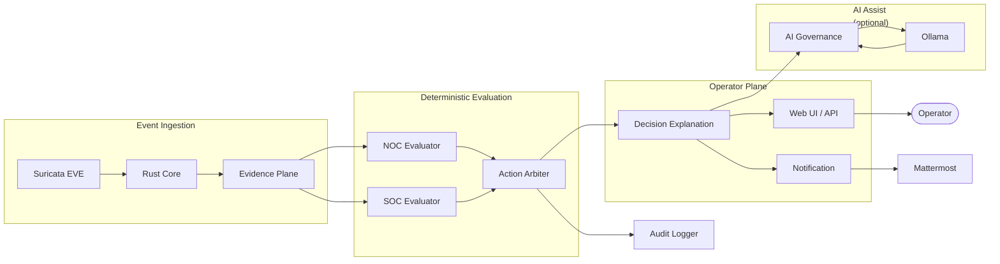

# Azazel-Edge

<p align="center">
  <a href="./README.md">
    
  </a>
  <a href="./README_ja.md">
    
  </a>
</p>

Azazel-Edge は、Raspberry Pi 向けのエッジ運用スタックです。主に以下を統合します。
- 内部ネットワーク/ゲートウェイ構成
- 決定論的な NOC/SOC 評価とアクション選択
- オペレータ向け Web UI + API + Runbook運用ワークフロー
- ローカル AI 補助（Ollama + Mattermost 連携、任意）

この README は、**2026-05-11 時点**でリポジトリ内のコード、スクリプト、テスト、git 履歴、GitHub issue/PR 情報を照合して作成しています。

<p align="center">
  
  
  
  
  
  
  <a href="https://github.com/01rabbit/Azazel-Edge/actions/workflows/ci.yml"></a>
</p>

## What is Azazel-Edge?

Azazel-Edge は、**緊急運用向けの軽量 SOC/NOC ゲートウェイ**で、Raspberry Pi 上で動作するよう設計されています。

**Who it's for**
- 一時的なネットワーク区画（イベント会場、現地拠点、演習環境）を運用するセキュリティ担当
- フル SIEM なしで初動トリアージを実施したいオペレータ
- ローカル完結かつオフライン対応のスタックでインシデント対応を訓練するチーム

**When to use it**
- 1時間以内にゲートウェイとアラートトリアージ画面を立ち上げたいとき
- クラウド接続がない、またはトラフィックを完全ローカルに閉じたいとき
- ブラックボックスではなく、決定論エンジン + 任意のローカルAI補助（Ollama）を使いたいとき

**What it is not**
- 本番向け SIEM や常設 SOC プラットフォームの代替
- オペレータ確認なしで自律判断する AI
- クラウド必須システム（コア機能はオフライン動作）

## Language Parity

翻訳ルールと用語統一は [`docs/LANGUAGE_PARITY.md`](docs/LANGUAGE_PARITY.md) で管理します。

## 検証済みの目的

このリポジトリで実装されている目的は次の通りです。

1. `br0` を中心とした内部セグメント（DHCP/NAT/forwarding）を構築し、運用面を提供する。
2. 正規化イベントを取り込み、NOC/SOC 状態を決定論的に評価する。
3. `observe` / `notify` / `throttle` / `redirect` / `isolate` を明示的に選択し、説明と監査情報を出力する。
4. ダッシュボード、トリアージ、Runbook、Mattermost 連携、決定論的デモを提供する。
5. 必要に応じて Ollama によるローカル LLM 補助を行う（デモのコア経路には必須ではない）。

根拠:
- ゲートウェイ基盤: `installer/internal/install_internal_network.sh`
- アクション選択: `py/azazel_edge/arbiter/action.py`
- Web/API 面: `azazel_edge_web/app.py`
- 決定論デモ: `bin/azazel-edge-demo`, `py/azazel_edge/demo/scenarios.py`
- AI ランタイム: `py/azazel_edge_ai/agent.py`, `systemd/azazel-edge-ai-agent.service`

## コアアーキテクチャ



1. **イベント取り込みと正規化**
   - Rust core が Suricata EVE (`AZAZEL_EVE_PATH`, 既定 `/var/log/suricata/eve.json`) を監視し、正規化 alert イベントを生成。
   - Unix socket (`/run/azazel-edge/ai-bridge.sock`) と JSONL ログへ転送可能。
2. **決定論評価**
   - NOC evaluator / SOC evaluator は `py/azazel_edge/evaluators/` 配下に実装。
   - Arbiter が却下理由付きで明示アクションを選択。
3. **運用プレーン**
   - Flask が dashboard (`/`), demo (`/demo`), ops workspace (`/ops-comm`), `/api/*` を提供。
   - Control daemon は `/run/azazel-edge/control.sock` で制御を受け付け。
4. **任意のAI補助プレーン**
   - AI agent が正規化イベント/手動問い合わせを処理し、advisory/metrics/audit JSONL を出力。
   - Ollama / Mattermost は compose ベーススクリプトで任意導入。

## 起動点とインターフェース

### サービス起動点
- Web app: `azazel_edge_web/app.py`（`systemd/azazel-edge-web.service` 経由で gunicorn 起動）
- Control daemon: `py/azazel_edge_control/daemon.py`（`systemd/azazel-edge-control-daemon.service`）
- AI agent: `py/azazel_edge_ai/agent.py`（`systemd/azazel-edge-ai-agent.service`）
- Rust core: `rust/azazel-edge-core/src/main.rs`（`systemd/azazel-edge-core.service`）
- EPD refresh timer: `systemd/azazel-edge-epd-refresh.timer`

### ウェブルート
- UI: `/`, `/demo`, `/ops-comm`
- Health: `/health`（トークン不要）
- CA メタ/ダウンロード: `/api/certs/azazel-webui-local-ca/meta`, `/api/certs/azazel-webui-local-ca.crt`

### 主要 API 群

| Group | Endpoints | Auth required |
|-------|-----------|---------------|
| State | `GET /api/state`, `GET /api/state/stream` | Yes |
| Control | `POST /api/mode`, `POST /api/action`, `/api/wifi/*`, `/api/portal-viewer*` | Yes |
| SoT | `POST /api/clients/trust`, `PUT/PATCH /api/sot/devices` | Yes |
| Dashboard | `GET /api/dashboard/*` | Yes |
| Triage | `/api/triage/*` | Yes |
| Runbooks | `GET /api/runbooks`, `POST /api/runbooks/propose`, `POST /api/runbooks/act` | Yes |
| Demo | `/api/demo/*` | Yes |
| AI | `POST /api/ai/ask`, `GET /api/ai/capabilities` | Yes |
| Mattermost | `POST /api/mattermost/command`, `POST /api/mattermost/message` | Token |
| Health | `GET /health` | No |
| CA cert | `GET /api/certs/*` | No |

### ソケット
- Control socket: `/run/azazel-edge/control.sock`
- AI bridge socket: `/run/azazel-edge/ai-bridge.sock`

### 認証挙動
- 多くの `/api/*` エンドポイントはトークン検証あり。
- installer 管理ランタイムでは `AZAZEL_AUTH_FAIL_OPEN=0` を既定とし、fail-closed 運用。
- token file 不在時の互換 fail-open は `AZAZEL_AUTH_FAIL_OPEN` で制御。
- 管理時の token file は `AZAZEL_WEB_TOKEN_FILE` 経由で `/etc/azazel-edge/web_token.txt`。

## Changelog

実装履歴とPRトレーサビリティは [`docs/CHANGELOG.md`](docs/CHANGELOG.md) を参照してください。

## 要件

### インストーラスクリプトが導入する主な依存
- コア/アプリスタック: `python3`, `python3-venv`, `network-manager`, `iw`, `dnsmasq`, `nginx`, `openssl`, `rustc`, `cargo` ほか
- セキュリティスタック（任意）: `docker.io`, `suricata`
- AIランタイム（任意）: `docker.io`, `qemu-user-static`, `binfmt-support`, `jq`

### Python 依存
`requirements/runtime.txt`:
- `Flask`
- `gunicorn`
- `rich`
- `textual`
- `Pillow`
- `requests`
- `PyYAML`

### 任意外部サービス
- Ollama (`security/docker-compose.ollama.yml`)
- Mattermost + PostgreSQL (`security/docker-compose.mattermost.yml`)
- OpenCanary (`security/docker-compose.yml`)

## インストールと再現

### 統合インストーラ

```bash
cd /home/azazel/Azazel-Edge
sudo ENABLE_INTERNAL_NETWORK=1 \
     ENABLE_APP_STACK=1 \
     ENABLE_AI_RUNTIME=1 \
     ENABLE_DEV_REMOTE_ACCESS=0 \
     bash installer/internal/install_all.sh
```

すべての installer トグルと runtime 変数は [設定](#設定) を参照してください。

### アプリスタックのみ

```bash
sudo ENABLE_SERVICES=1 bash installer/internal/install_migrated_tools.sh
```

### AIランタイムのみ

```bash
sudo ENABLE_OLLAMA=1 ENABLE_MATTERMOST=1 bash installer/internal/install_ai_runtime.sh
```

導入後（既定）:
- 実体は `/opt/azazel-edge`
- ランチャは `/usr/local/bin`
- systemd unit は配置され、設定により有効化される

## 設定

### インストーラトグル
- `ENABLE_INTERNAL_NETWORK=1|0`
- `ENABLE_APP_STACK=1|0`
- `ENABLE_AI_RUNTIME=1|0`
- `ENABLE_DEV_REMOTE_ACCESS=1|0`
- `ENABLE_RUST_CORE=1|0`

### 主な設定ファイル
- `/etc/default/azazel-edge-web`（Web/Mattermost 環境変数）
- `/etc/default/azazel-edge-security`（例: `SURICATA_IFACE`）
- `/etc/azazel-edge/first_minute.yaml`（例: `suppress_auto_wifi`）

### 主要環境変数（抜粋）
- Web bind: `AZAZEL_WEB_HOST`, `AZAZEL_WEB_PORT`
- Rust core: `AZAZEL_EVE_PATH`, `AZAZEL_AI_SOCKET`, `AZAZEL_NORMALIZED_EVENT_LOG`, `AZAZEL_DEFENSE_ENFORCE`
- AI agent: `AZAZEL_OLLAMA_ENDPOINT`, `AZAZEL_LLM_MODEL_PRIMARY`, `AZAZEL_LLM_MODEL_DEGRADED`
- Mattermost command: `AZAZEL_MATTERMOST_COMMAND_TRIGGER`, `AZAZEL_MATTERMOST_COMMAND_TOKEN_FILE`
- Runbook 制御実行ゲート: `AZAZEL_RUNBOOK_ENABLE_CONTROLLED_EXEC`

### トークン認証
- `X-AZAZEL-TOKEN`（または `X-Auth-Token` / `?token=`）を受け付ける。
- token file 未配置時は保護 API でも実質オープンになる実装。

## 使い方

### サービス状態確認
```bash
sudo systemctl status \
  azazel-edge-control-daemon \
  azazel-edge-web \
  azazel-edge-ai-agent \
  azazel-edge-core
```

### 主要アクセス先（既定構成）
- Webバックエンド: `http://127.0.0.1:8084/`
- 内部ネットワーク + HTTPSプロキシ導入時: `https://172.16.0.254/`
- Mattermost（有効時）: `http://172.16.0.254:8065/`

### API 例
```bash
TOKEN="$(cat ~/.azazel-edge/web_token.txt)"
curl -sS -H "X-AZAZEL-TOKEN: ${TOKEN}" http://127.0.0.1:8084/api/state | jq .
```

### SoT devices API 契約
- `PUT /api/sot/devices`
  - SoT の `devices` 配列を全置換します。
  - リクエスト: `{"devices": [<SoT device object>]}`。
- `PATCH /api/sot/devices`
  - `id` 単位の merge/upsert（削除セマンティクスなし）。
  - 既存フィールドは、payload で上書きした項目以外は保持されます。
  - リクエスト: `{"devices": [<id を含む partial/full SoT device object>]}`。
- 両エンドポイント共通:
  - token 認証が必要（`@require_token()`）。
  - 更新後の SoT 全体を `SoTConfig.from_dict` で検証。
  - `AZAZEL_SOT_AUDIT_LOG` に監査ログを記録（`actor` は `X-AZAZEL-ACTOR` 優先、次に接続元アドレス）。
  - 更新成功時に `refresh` を実行して再評価をトリガー。

### 決定論デモ

```bash
bin/azazel-edge-demo list
bin/azazel-edge-demo run mixed_correlation_demo
```

### RunbookブローカーCLI
```bash
python3 py/azazel_edge_runbook_broker.py list
python3 py/azazel_edge_runbook_broker.py show rb.noc.service.status.check
python3 py/azazel_edge_runbook_broker.py propose --question "Wi-Fi intermittent disconnects"
```

## 開発

### ローカルセットアップ
```bash
python3 -m venv .venv
. .venv/bin/activate
pip install -U pip wheel setuptools
pip install -r requirements/runtime.txt
```

### systemdを使わない直接起動
```bash
PYTHONPATH=. python3 azazel_edge_web/app.py
PYTHONPATH=. python3 py/azazel_edge_control/daemon.py
PYTHONPATH=. python3 py/azazel_edge_ai/agent.py
```

補足:
- 一部テストは `azazel_edge_web` をトップレベル import するため `PYTHONPATH=.` が必要。
- `py/azazel_edge_status.py` は常駐表示系（Ctrl-C で終了）で、一般的な `--help` CLI ではない。

## テスト

実行:
```bash
PYTHONPATH=. .venv/bin/pytest -q
```

2026-05-11 検証結果: **224 passed, 16 subtests passed**

## リポジトリ構成

| Path | 役割 |
|---|---|
| `py/azazel_edge/` | Evidence Plane、evaluator、arbiter、audit、SoT、triage、demo、研究/runtime extension |
| `py/azazel_edge_control/` | control daemon と action handler |
| `py/azazel_edge_ai/` | AI agent integration と M.I.O. assist path |
| `azazel_edge_web/` | Flask backend、dashboard、ops-comm UI |
| `rust/azazel-edge-core/` | Rust defense core |
| `runbooks/` | Runbook registry |
| `systemd/` | service / timer units |
| `security/` | compose stack と security-side assets |
| `installer/` | unified installer と staged install scripts |
| `docs/` | 公開向け architecture、AI operation、persona、demo 文書 |
| `tests/` | unit / regression coverage |

## 運用・デプロイ

### 含まれるsystemdユニット
- `azazel-edge-control-daemon.service`
- `azazel-edge-web.service`
- `azazel-edge-ai-agent.service`
- `azazel-edge-core.service`
- `azazel-edge-epd-refresh.service`
- `azazel-edge-epd-refresh.timer`
- `azazel-edge-opencanary.service`
- `azazel-edge-suricata.service`

### セキュリティ/AIスタック導入スクリプト
- セキュリティスタック: `installer/internal/install_security_stack.sh`
- AIランタイム: `installer/internal/install_ai_runtime.sh`
- Composeアセット: `security/`

### 主なランタイムログ/成果物
- `/var/log/azazel-edge/normalized-events.jsonl`
- `/var/log/azazel-edge/ai-events.jsonl`
- `/var/log/azazel-edge/ai-llm.jsonl`
- `/var/log/azazel-edge/triage-audit.jsonl`
- `/run/azazel-edge/ui_snapshot.json`

## ドキュメント

### For operators

| Document | Description |
|----------|-------------|
| [AI Operation Guide](docs/AI_OPERATION_GUIDE.md) | LLM thresholds, daily checks, incident response |
| [Demo Guide](docs/DEMO_GUIDE.md) | Deterministic demo replay walkthrough |
| [Demo Guide (Japanese)](docs/DEMO_GUIDE_JA.md) | 日本語版デモ手順 |

### For developers

| Document | Description |
|----------|-------------|
| [P0 Runtime Architecture](docs/P0_RUNTIME_ARCHITECTURE.md) | Pipeline, modules, and constraints |
| [AI Agent Build and Operation Detail](docs/AI_AGENT_BUILD_AND_OPERATION_DETAIL.md) | AI agent internals |
| [M.I.O. Persona Profile](docs/MIO_PERSONA_PROFILE.md) | Operator persona design spec |
| [Post-demo Main Integration Boundary (#104)](docs/POST_DEMO_MAIN_INTEGRATION_104.md) | What is mainline vs. exhibition-only |
| [Post-demo Socket Permission Model (#105)](docs/POST_DEMO_SOCKET_PERMISSION_MODEL_105.md) | Unix socket permission decisions |
| [Next Development Execution Index 2026Q2](docs/NEXT_DEVELOPMENT_EXECUTION_INDEX_2026Q2.md) | Roadmap and execution plan |

### For contributors (AI agents and humans)

| Document | Description |
|----------|-------------|
| [AGENTS.md](AGENTS.md) | AI agent working charter — read before making any change |
| [CONTRIBUTING.md](CONTRIBUTING.md) | Human contributor guide (branch, PR, test rules) |
| [Language Parity](docs/LANGUAGE_PARITY.md) | README translation and terminology rules |
| [Changelog](docs/CHANGELOG.md) | PR and feature traceability history |
## Limitations and Known Issues

### Design constraints (by intent)

- Rust enforcement path is inactive by default:
  - `AZAZEL_DEFENSE_ENFORCE=false` in `systemd/azazel-edge-core.service`
  - `maybe_enforce()` in Rust core is a placeholder pending dry-run validation
- AI assist is optional and bounded — the deterministic path works without Ollama
- Ollama models above 2b parameters are not recommended for co-located deployments
- Test count and runbook count are verified at each release; see CI results for current status.

### Known bugs

- `python3 py/azazel_edge_epd.py --help` fails with `ValueError: incomplete format`

### Open work items

See [GitHub Issues](https://github.com/01rabbit/Azazel-Edge/issues) for the current list.
Priority items as of 2026-05-11:

- #149 Execution Plan 2026Q2: Enforcement/CI/Runtime Hardening Index *(P0)*
- #143 [Topo-Lite] 緊急時 triage の認証・内部ネットワーク・単一画面UI方針を確定 *(P0)*
- #140 Epic: Azazel-Topo-Lite MVP *(P0)*
- #153 [P2] Implement Decision Trust Capsule for audit-grade explainability *(P1)*
- #154 [P2] Correlation engine expansion: sequence and distributed patterns *(P1)*
- #155 [P2] Add SoT dynamic update API with re-evaluation trigger *(P1)*
- #157 [P3] Dashboard visibility: AI contribution/fallback metrics *(P1)*
- #158 [P3] Notification fallback hardening (SMTP/Webhook + ack audit) *(P1)*

## 現在の状態

- 直近のマージ済み PR: #95, #94, #88, #87, #86
- Python test module 数: **48**
- runbook YAML 数: **15**
- 利用可能なデモ: `mixed_correlation_demo`, `noc_degraded_demo`, `soc_redirect_demo`

## ライセンス

このリポジトリは MIT License で公開されています。詳細は [LICENSE](LICENSE) を参照してください。
