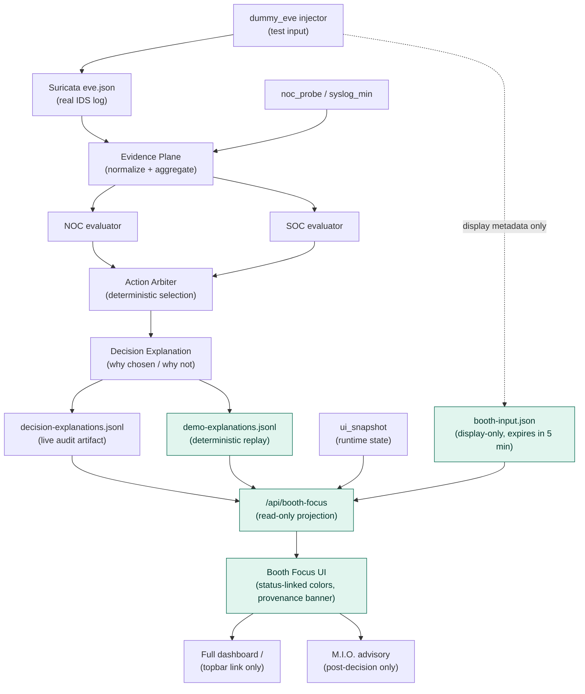

# Booth Focus Decision View

Last updated: 2026-07-25

## Scope
This document describes where the Booth Focus view (`/booth-focus`) sits in the runtime architecture. The view is a read-only, high-legibility projection of artifacts that the deterministic decision pipeline already produces. It adds no new decision authority: it never evaluates a scenario, never synthesizes or modifies a decision, and never writes an audit record.

## Position in the Architecture

Highlighted (teal) nodes are the Booth Focus additions. Everything else is the pre-existing P0 decision pipeline described in [P0_RUNTIME_ARCHITECTURE.md](../P0_RUNTIME_ARCHITECTURE.md) and [decision-loop.md](decision-loop.md); the Booth Focus work does not modify it.

## Components

| Component | Kind | Notes |
|---|---|---|
| `/booth-focus` page (`booth_focus.html/css/js`) | Added | High-legibility view for short Arsenal booth walkthroughs. Renders NOC/SOC posture with status-linked colors (green/amber/red), the selected action, rejected alternatives, safety boundary, and the audit trail. |
| `/api/booth-focus` | Added | Read-only projection endpoint. Reads the newest valid decision explanation (live or deterministic replay) plus the runtime state snapshot. Token-protected like `/api/state`. |
| `booth-input.json` provenance marker | Added | Written by `dummy_eve` on injection. Presentation metadata only: evaluators and the arbiter never read it, and it expires after 5 minutes so ordinary live telemetry cannot be mislabeled as test input. |
| `demo-explanations.jsonl` | Added (read path) | Optional deterministic-replay explanation source for offline booth fallback, labeled `DETERMINISTIC REPLAY — LOCAL / OFFLINE` in the UI. |
| Decision pipeline | Unchanged | Evidence Plane, evaluators, arbiter, explanation, and audit logging are untouched. |
| Full dashboard (`/`) | Unchanged | Only a topbar link to Booth Focus Mode was added. |

## Mode Identification
The UI banner always states the input provenance so booth visitors cannot mistake demo traffic for production traffic:

- `DETERMINISTIC REPLAY — LOCAL / OFFLINE` — explanation came from the replay artifact, or the runtime reports `deterministic_replay`.
- `LIVE TEST INPUT — REAL PIPELINE` — the provenance marker confirms injected test events flowing through the real pipeline.
- `LIVE PIPELINE — INPUT SOURCE UNMARKED` — no valid provenance marker; the operator must verify the source before presenting.

## Safety Constraints
- The view is a projection, not a participant: no evaluation, no decision synthesis, no audit writes.
- The safety boundary (`DRY RUN`, `OPERATOR-OWNED GATEWAY`, `AI IS NOT DECISION AUTHORITY`) is always visible.
- The M.I.O. link is post-decision advisory only; its prompt is fixed to explain state and explicitly forbids proposing a decision change.

## Related Documents
- [P0_RUNTIME_ARCHITECTURE.md](../P0_RUNTIME_ARCHITECTURE.md)
- [decision-loop.md](decision-loop.md)
- [../ARSENAL_DEMO_PROFILE.md](../ARSENAL_DEMO_PROFILE.md)
- [../DEMO_GUIDE.md](../DEMO_GUIDE.md)
