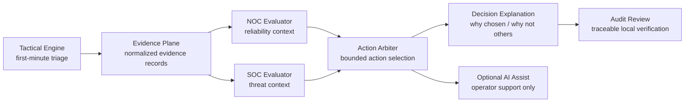

# BHUSA 2026 Talk Track

Use this file as the canonical presenter script for Arsenal Station 4.

Session:

- Title: Azazel-Edge: Deterministic Edge Decision Support for Constrained SOC/NOC Operations
- Presenter: Makoto "Mr. Rabbit" SUGITA
- Date: Wednesday, August 5, 2026
- Time: 10:10am-11:10am
- Location: Arsenal Station 4, Business Hall
- Track: Network

## Message discipline

Preserve these points in every booth conversation:

- Azazel-Edge is a deterministic edge decision appliance for constrained local networks.
- NOC reliability and SOC threat context are evaluated separately.
- The Action Arbiter selects one bounded action from `observe`, `notify`, `throttle`, `redirect`, or `isolate`.
- The system records selected evidence, rejected alternatives, and structured explanation.
- Optional AI assist is bounded to operator support after deterministic decision stages.
- Deterministic replay is used for booth stability only and does not replace the normal live Tactical first-pass path.

Avoid these framings before Vegas:

- cloud SOC replacement
- AI-led autonomous defense
- full CTI platform
- broad agentic SOC rebrand

## Canonical diagram

Presenter note:
- In the booth, say that replay feeds the same deterministic downstream path.
- Do not say that replay replaces live Tactical first-pass operation.

## 5-minute compressed walkthrough

### 1. Opening: 30 seconds

"Azazel-Edge is for constrained SOC/NOC operations where you have limited
infrastructure, limited personnel, unstable connectivity, and very little time
to decide. The point is not autonomous AI. The point is deterministic,
inspectable action selection at the edge."

### 2. Problem framing: 45 seconds

- Small, temporary, and rapidly deployed networks still need security and
  reliability decisions.
- Operators often cannot depend on cloud tooling or large analyst teams.
- A short-lived environment still needs bounded, reviewable action choices.

### 3. Deterministic pipeline: 90 seconds

- Live path starts with Tactical Engine first-minute triage on time-sensitive
  events.
- Inputs are normalized into the Evidence Plane.
- NOC and SOC are evaluated separately instead of collapsing everything into one
  opaque score.
- The Action Arbiter selects one bounded action:
  `observe`, `notify`, `throttle`, `redirect`, or `isolate`.
- The explanation layer records why the selected action was chosen and why the
  other actions were rejected.

### 4. Booth demo framing: 45 seconds

- For Black Hat USA 2026, deterministic replay is the preferred booth path.
- Replay is used because it keeps evidence, evaluation, action selection, and
  explanation stable in a short public session.
- Replay is a presentation technique only. Normal operation still assumes live
  Tactical first-pass handling when available.

### 5. What the visitor should see: 60 seconds

- Evidence summary with IDs
- Separate NOC and SOC outputs
- Selected bounded action
- `why_chosen`
- `why_not_others`
- Audit trace or review command

### 6. Close: 30 seconds

"The contribution here is not a broad SOC platform. It is a deterministic edge
decision loop that stays inspectable under constrained conditions and can prove
what it chose, why it chose it, and what it rejected."

## 60-minute booth outline

### Segment 1: 0 to 5 minutes

- Introduce the accepted public title and the constrained-network problem.
- State the boundaries: same Azazel-Edge core platform, not a separate product.
- State the guardrails: deterministic logic remains authoritative; AI is
  optional support only.

### Segment 2: 5 to 15 minutes

- Walk through the canonical diagram.
- Explain Tactical Engine as first-minute triage.
- Explain Evidence Plane normalization.
- Explain why NOC and SOC stay separate.

### Segment 3: 15 to 25 minutes

- Explain bounded action selection.
- Describe each action class briefly:
  `observe`, `notify`, `throttle`, `redirect`, `isolate`.
- Explain why bounded actions matter in constrained operations.

### Segment 4: 25 to 35 minutes

- Run or describe the selected replay scenario.
- Show the deterministic downstream path.
- Emphasize that the same input and profile should produce the same decision.

### Segment 5: 35 to 45 minutes

- Show explanation output:
  selected action, rejected alternatives, operator wording.
- Show audit review path and explain the local traceability claim carefully.
- If asked about AI, explain that AI is post-decision assist, not the decision
  authority.

### Segment 6: 45 to 55 minutes

- Discuss operational fit:
  constrained sites, temporary deployments, unstable connectivity, minimal
  staffing.
- Discuss failure handling:
  replay fallback, optional component failure, offline operation.

### Segment 7: 55 to 60 minutes

- Q&A and recap.
- Re-anchor on the accepted theme:
  deterministic edge decision support for constrained SOC/NOC operations.

## Cross-check list before presenting

- [ ] Title matches `docs/arsenal/blackhat-usa-2026.md`
- [ ] Replay is described as booth-only stability technique
- [ ] AI is described as optional operator support only
- [ ] NOC/SOC separation is described explicitly
- [ ] Explanation and rejected alternatives are part of the story
- [ ] No wording implies cloud SOC replacement or AI-led autonomous defense
